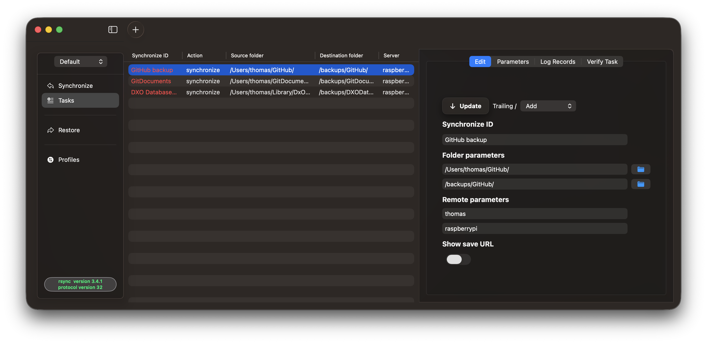

## Hi there 👋

This is the repository for RsyncUI, a SwiftUI based macOS application. RsyncUI is released for *macOS Sonoma and later*.
RsyncUI is a GUI on the Apple macOS platform for the command line tool [rsync](https://github.com/WayneD/rsync). It is `rsync` which executes
the synchronize data tasks. The GUI is *only* for organizing tasks, setting parameters to `rsync` and make it easier to use `rsync`.
The [user documentation](https://github.com/rsyncOSX/mydocsy) is based upon a fork of the excellent Hugo based theme Docsy.

| App     | UI                  | Latest version                                                                                      |
|---------|---------------------|-----------------------------------------------------------------------------------------------------|
| RsyncUI | SwiftUI, declarativ | v2.3.7 - [7 March 2025](https://github.com/rsyncOSX/RsyncUI/releases) - in **active development** |
|  |  | [user guide](https://rsyncui.netlify.app/docs/) and [changelog](https://rsyncui.netlify.app/blog/) |

### Install by Homebrew

RsyncUI might be installed by Homebrew or by direct Download. It is signed and notarized by Apple.

| App      | Homebrew | macOS |
| ----------- | ----------- |   ----------- |
| RsyncUI   | `brew install --cask rsyncui`    | macOS Sonoma and later |

### External task executing rsync

Please be aware it is an external task *not controlled* by RsyncUI, which executes the command-line tool rsync. The progress and termination of the external
rsync task are monitored. The user can abort the task at any time. Please let the abort finish and cleanup properly before starting a new task.
It might take a few seconds. If not, RsyncUI might become unresponsive.
