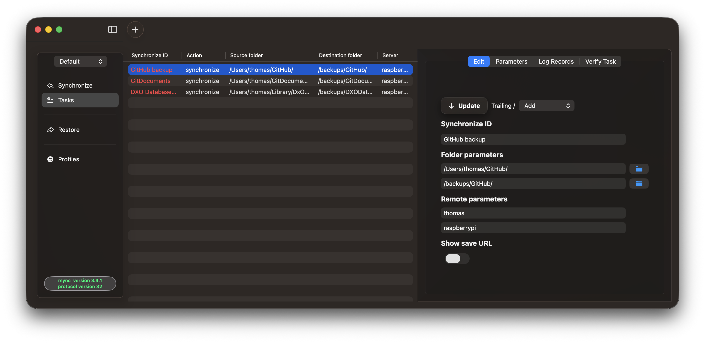

# RsyncUI

[](https://github.com/rsyncOSX/RsyncUI/blob/main/Licence.MD)

[](https://github.com/rsyncOSX/RsyncUI/issues)

A SwiftUI-based macOS GUI for [rsync](https://github.com/WayneD/rsync). The application organizes synchronization tasks, configures rsync parameters, and provides a user-friendly interface for the rsync command line tool.

## Requirements

- macOS Sonoma or later

## Installation

Install via Homebrew:
```bash
brew install --cask rsyncui
```

Or download directly from the [releases page](https://github.com/rsyncOSX/RsyncUI/releases). The application is signed and notarized by Apple.

## Version

Current version: v2.9.1 (March 4, 2026) - in active development

## Documentation

- [User documentation](https://rsyncui.netlify.app/docs/) ([repository](https://github.com/rsyncOSX/rsyncuidocs))
- [Changelog](https://rsyncui.netlify.app/blog/)



