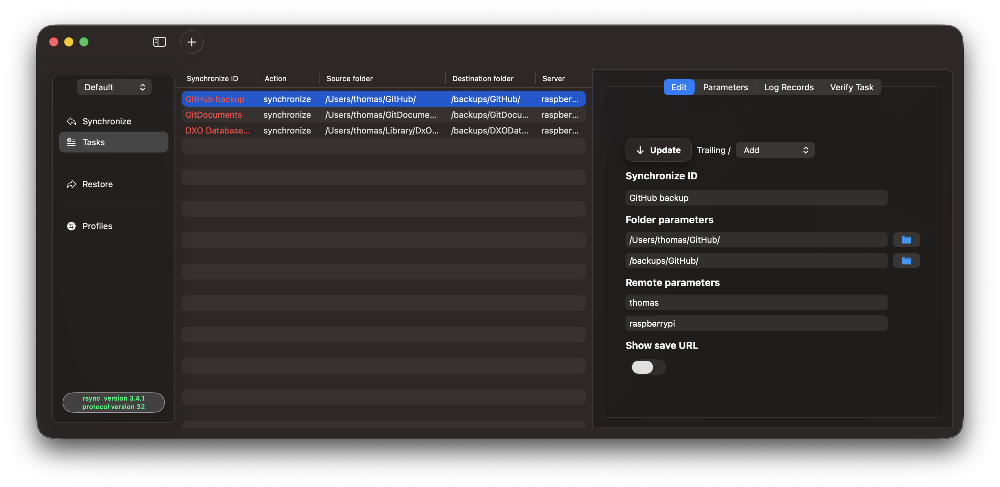

# RsyncUI
[](https://github.com/rsyncOSX/RsyncUI/blob/main/Licence.MD)


[](https://github.com/rsyncOSX/RsyncUI/issues)

RsyncUI is a SwiftUI macOS GUI for [rsync](https://github.com/WayneD/rsync) — it handles task organisation and parameter configuration so you can get the most out of rsync without touching the command line.

## Requirements

- macOS Sonoma or later

## Installation

Install via Homebrew:

```bash
brew install --cask rsyncui
```

Or download directly from the [releases page](https://github.com/rsyncOSX/RsyncUI/releases). The application is signed and notarized by Apple.

## Latest release

### v3.0.4 — September 7, 2026

#### 🐛 Crash fixes

- Fixed the recurring AppKit `Update Constraints in Window` crash during startup.
- Replaced the problematic root `NavigationSplitView` implementation.
- Stabilized task-menu identities and selection handling.
- Removed an invisible task editor that caused unnecessary Inspector layout updates.
- Moved Add Task presentation into a dedicated sheet.
- Added stable Inspector presentation state and column sizing.

#### 🎨 Interface improvements

- Redesigned the sidebar as a fixed-width, 220-point panel with a flexible detail area.
- Added a dedicated toolbar button for showing and hiding the sidebar.
- Organized sidebar entries into Actions, Tools, and Management sections.
- Preserved context-sensitive Snapshot and Restore entries.
- Retained profile selection, scheduling status, version information, and notification messages.
- Removed unwanted outer padding from the main application interface while retaining padding on the startup screen.

#### ▶️ Synchronization details

- Anchored the Synchronize play button directly to the divider between the two results tables.
- The play button now remains centered between the tables when the window is resized.
- Consolidated synchronization execution and confirmation handling.

#### 📦 Version and update information

- Updated the application version from `3.0.3` to `3.0.4`.
- Updated the application and widget build number from `201` to `202`.
- Updated the version feed so supported older releases point to the `v3.0.3` download.
- Added `3.0.2` to the supported update-feed entries.
- Updated README release information and download badges for `v3.0.3`.

#### 🧹 Repository maintenance

- Removed obsolete repository instruction files.
- Removed the old `changestr.md` changelog file.
- Simplified project documentation.

#### ✅ Verification

- Application builds successfully with Swift 6.
- All 58 tests across 11 suites pass.
- Startup was verified using existing profiles, configurations, and schedules without triggering the previous layout crash.

## Documentation

- [User documentation](https://rsyncui.netlify.app/docs/) (built on the Hugo-based [Docsy](https://github.com/google/docsy) theme)
- [Release notes](https://rsyncui.netlify.app/blog/)

If RsyncUI is useful to you, a ⭐ on [the repository](https://github.com/rsyncOSX/RsyncUI) is always appreciated!


