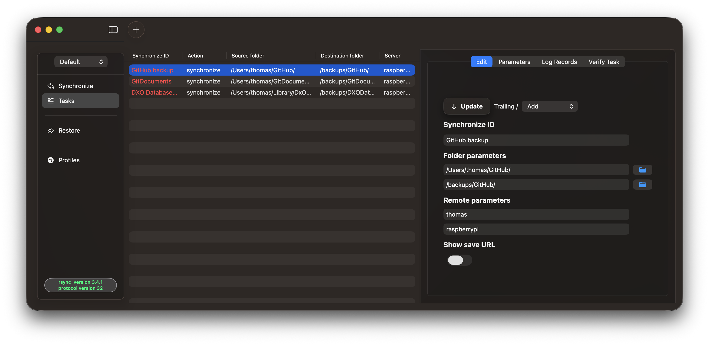

# RsyncUI
[](https://github.com/rsyncOSX/RsyncUI/blob/main/Licence.MD)


[](https://github.com/rsyncOSX/RsyncUI/issues)

RsyncUI is a SwiftUI macOS GUI for [rsync](https://github.com/WayneD/rsync) — it handles task organisation and parameter configuration so you can get the most out of rsync without touching the command line.

If RsyncUI is useful to you, a ⭐ on [the repository](https://github.com/rsyncOSX/RsyncUI) is always appreciated!

## Requirements

- macOS Sonoma or later

## Installation

Install via Homebrew:

```bash
brew install --cask rsyncui
```

Or download directly from the [releases page](https://github.com/rsyncOSX/RsyncUI/releases). The application is signed and notarized by Apple.

## Latest release

- v3.0.5 — September 10, 2026 — in active development

## Documentation

- [User documentation](https://rsyncui.netlify.app/docs/) (built on the Hugo-based [Docsy](https://github.com/google/docsy) theme)
- [Release notes](https://rsyncui.netlify.app/blog/)

## Swift packages

RsyncUI uses the following Swift Package Manager dependencies:

| Package | Function in RsyncUI |
| --- | --- |
| [DecodeEncodeGeneric](https://github.com/rsyncOSX/DecodeEncodeGeneric) | Encodes application data as JSON for persistent storage. |
| [ParseRsyncOutput](https://github.com/rsyncOSX/ParseRsyncOutput) | Parses rsync output into transfer statistics, including file counts, created and deleted files, and data sizes for estimates and execution results. |
| [ProcessCommand](https://github.com/rsyncOSX/ProcessCommand) | Runs supporting commands, such as SSH key creation, connection checks, and snapshot deletion, with output and termination handlers. |
| [RsyncArguments](https://github.com/rsyncOSX/RsyncArguments) | Builds rsync and SSH arguments for synchronization, dry runs, snapshots, restoration, verification, and remote file listings. |
| [RsyncProcessStreaming](https://github.com/rsyncOSX/RsyncProcessStreaming) | Executes rsync processes and streams their output to handlers for progress, errors, and completion. |
| [RsyncUIDeepLinks](https://github.com/rsyncOSX/RsyncUIDeepLinks) | Creates, parses, and validates deep-link URLs for profile actions and widget integration. |
| [SSHCreateKey](https://github.com/rsyncOSX/SSHCreateKey) | Prepares SSH key creation and connection arguments, manages key paths, and checks whether a public key exists. |


